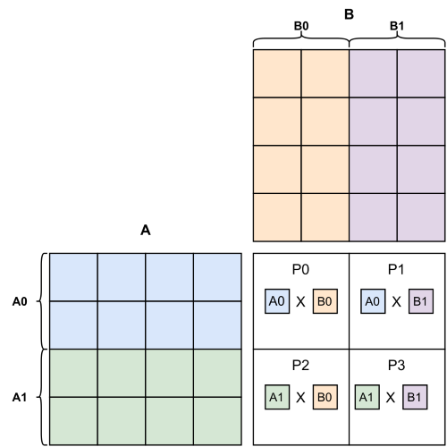
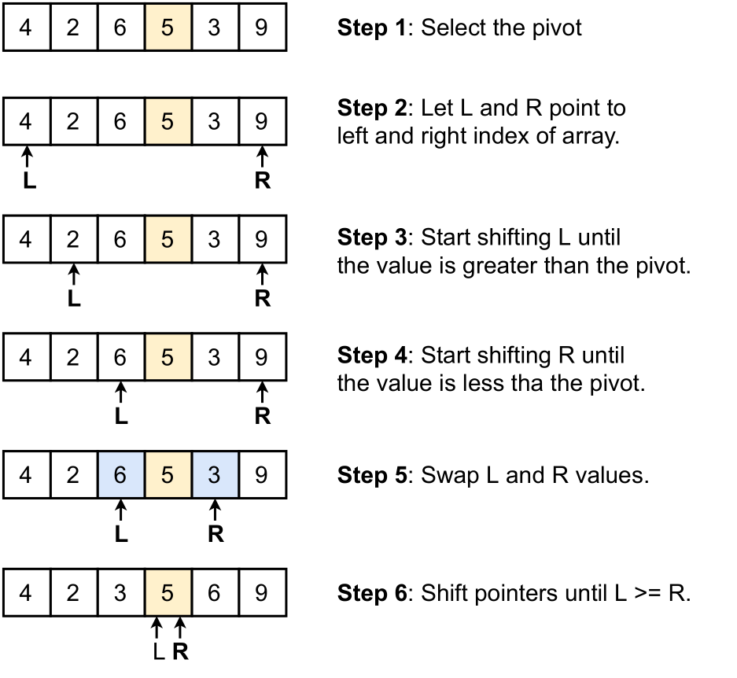

# **MPI examples in C**

All the examples contain small reports (readme files) containing the results on several tests. Some of the are speedup, weak and strong scalability. Some where tested on a cluster computer.

## **Example 1: 1D Stencil**
The implemention of the 1D stencil operation using MPI is shown in [example 1](https://github.com/dikioth/MPI-examples/tree/main/example1_stencil). 

## **Example 2: Matrix-Matrix multiplication**
The implementation of Matrix-Matrix multiplication can be found in [example 2](https://github.com/dikioth/MPI-examples/tree/main/example2_matrix_multiplication). 

## **Example 3: The Parallel Quicksort algorithm**
The implementation of Parallel quicksort can be found in [example 3](https://github.com/dikioth/MPI-examples/tree/main/example3_parallell_quicksort). 

## **Example 4: Conjugate gradient method**
To be finished.