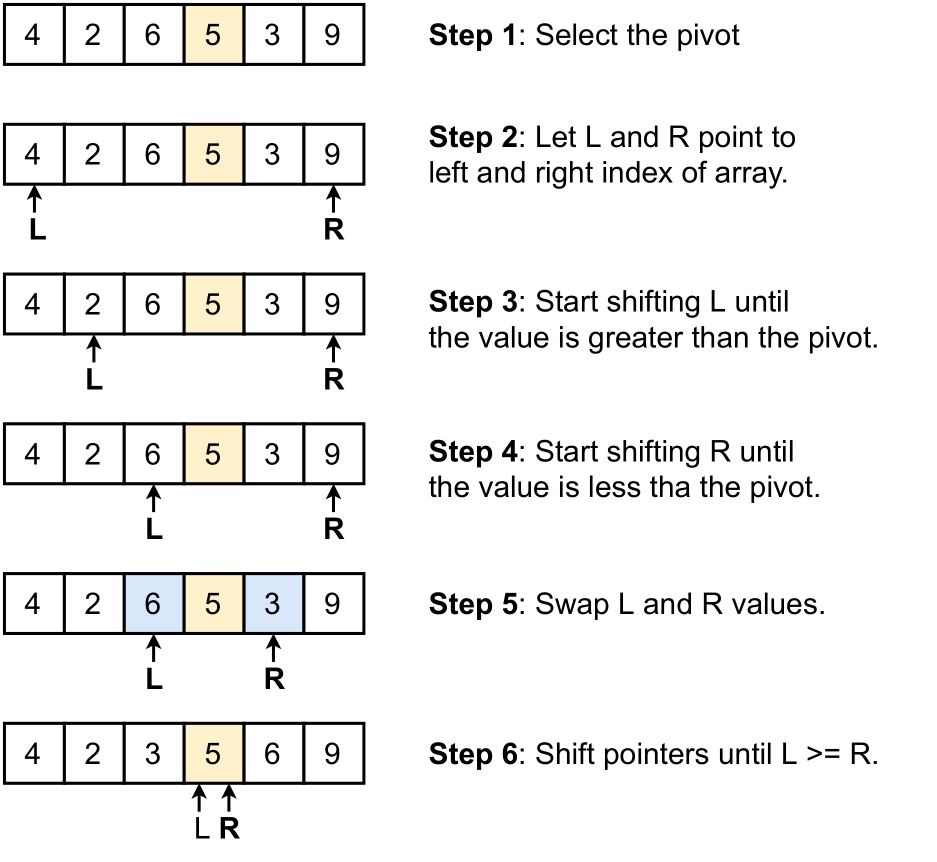

Introduction
============

Sorting is an important kernel for sequential and multiprocessing
computing. The quicksort algorithm is an effective *divide-and-conquer*
algorithm. It divides a sorting problem into sub-problems, which are in
turn further divided into more sub-problems which are solved
recursively. These sub-problems are parallelizable and the performance
can be further improved. The parallelization will be done using the
Message Passing Interface (MPI) standard.

Theory
======

The quicksort algorithm is a divide-and-conquer sorting algorithm. It
consists in picking a pivot element and partitioning the array in
sub-arrays smaller and greater than the pivot element.. After selecting a
pivot element, the elements lower and greater than the pivot element are
divided in the left and the right hand side of the pivot respectively.
These partitioned sides are further partitioned by iterating the same
quicksort procedure.

The left and right partitioning is done by *swapping* elements (See Fig.
below). Starting by pointing the index of left and right
edge elements. The algorithm iterates through all elements and performs
a swap when an element is found to be less or equal than the pivot
element.

In the parallel quicksort, the swapping is done in chunks between
processes. (See Fig. below). After locally partition a sub-array the
process communicates with each other so that the half of the processes
contain elements lower or equal than the pivot value and the other half
contains elements greater that the pivot value. Algorithm below
describes the parallel quicksort algorithm.

Method
======

The parallelization was done using . First, the process reads the input
array and splits the data in equally chunks to all processes using the
procedure. Then, each process performs a local sort using the sequential
quicksort. Later, all processes perform a global sort. The pivoting
methods (chosen by user) are

-   **Pivot 1:** Median of one process in group.

-   **Pivot 2:** Median of medians of all processes in group.

-   **Pivot 3:** Mean of medians of all processes in group.

Finally the process gathers back all results into a single array using .
Gathering data using would not work because the final results of each
process are of different size.

Result
======

All tests were performed on a cluster computer running with memory and
two and all execution time presented here were performed ten (10) times
and averaged out.

The algorithm was tested on four different input arrays: One array with
elements in descending order and three arrays with the following three
random distribution

-   Uniform distribution:  `x`

-   Exponential distribution : `- \lambda  log (1- x  )`

-   Normal distribution : `sqrt(-2 log x) cos(2 pi y)`

where `x ~ U(0,1)` and `y ~ U(0,1)`.

The results on running different pivoting methods for different array distributions are shown in Table below. Pivot method 1 is
slightly faster than pivot method 2 and 3.

 Sequence | **Pivot 1** | **Pivot 2** | **Pivot 3**|
| --------| ----------- |-------------|------------|
 Uniform| 5.2932 | 6.2021 | 6.0442
 Exponetial| 4.7222 | 5.3062 | 5.3227
 Normal| 4.5011 | 4.8617 | 4.6478
 Descending order| 2.5040 | 2.6269 | 2.5728

After each iteration in the recursion call, each process holds sub-array
with different size. The percentage of the sub-array array with respect
to the original input size were logged. The results of running an
example of running 4M input size with different distribution is shown in

***Uniform distributed input with pivot method 1***

***Uniform distributed input with pivot method 2***

***Uniform distributed input with pivot method 3***

***Exponential distributed input with pivot method 1***

***Exponential distributed input with pivot method 2***

***Exponential distributed input with pivot method 3***

***Normal distributed input with pivot method 1***

***Normal distributed input with pivot method 2***

***Normal distributed input with pivot method 3***

***Descending order input with pivot method 1***

***Descending order input with pivot method 2***

***Descending order input with pivot method 3***

The algorithm performance was evaluated using the speedup, the strong and weak scalability test. The results of the strong and weak
scalability test are presented in Table below. The speedup
was taken from the strong scale results and is shown in Fig below.

| Num processes | Strong scale (Input size/Mean time) | Weak scale (Input size/Mean time) | 
|---------------|--------------|------------|
|1 | 80M / 11.0790s | 10M / 1.2376s |
|2 | 80M /6.5475s | 20M / 1.6622s|
|4 | 80M /4.0020s | 40M / 2.1162s|
|8 | 80M /2.9567s | 80M / 3.1343s|
|16 | 80M/  1.5775s | 160M / 3.2841s|

Discussion
==========

Results prove that the pivoting method 1
distributes the load data well balanced for uniform, exponential and
normal distributed data. At each iteration, the processes holds 25% of the total data. Although this perfect balance is broken when tested on an input data with descending order, pivoting method 1 distributes data load better than the others. Pivoting method 2 and 2 tend to heavily load the data into one process at each iteration. At the last iteration, process 3 holds all the data before process 0 ( process) collects back the results from all process. Results shows a tight computation time performance. However, in a efficient algorithm implementation, we prefer to also keep a balanced data load. Thus, pivoting method 1 is the best choice.

Results proves that the algorithm implementation is
strong scalable. Increasing the number of processes by a factor of two on the same input size results in a decreasing computation time at around 2s, which leads to an almost linear behavior in the speedup. The results also shows that the algorithm implementation is weak scalable. A clear example is by comparing the results of running a 80M input size with 8 processes and a 160M input size with 16 processes. The computation time differs by around 0.15s.
